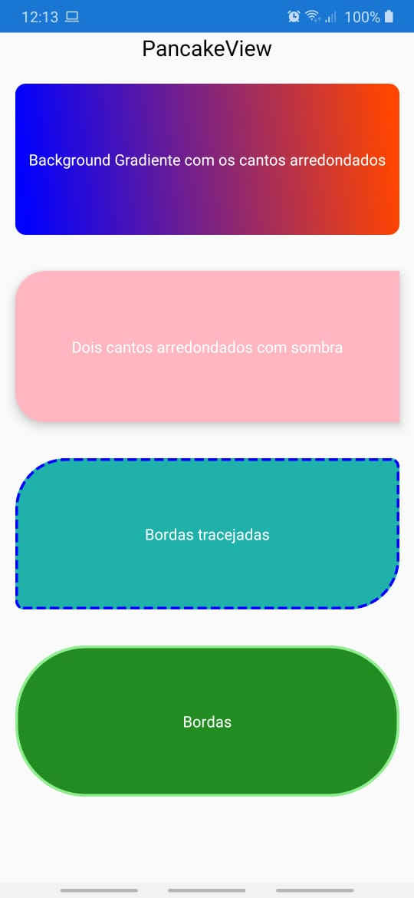

# PancakeView-Xamarin.Forms
Criando campos personalizados com o PancakeView. Cantos arredondados, background gradient, sombra e bordas personalizadas.

https://www.nuget.org/packages/Xamarin.Forms.PancakeView/

### Código
**_Declaração do namespace_**


```
xmlns:pancake="clr-namespace:Xamarin.Forms.PancakeView;assembly=Xamarin.Forms.PancakeView"
```

**_Criação dos campos_**


```
<StackLayout>
            <Label Text="PancakeView"
                   HorizontalTextAlignment="Center"
                   TextColor="#000"
                   FontSize="Medium"/>

            <pancake:PancakeView BackgroundGradientEndColor="Blue"
                                 BackgroundGradientStartColor="OrangeRed"
                                 BackgroundGradientAngle="75"
                                 CornerRadius="10"
                                 Margin="15"
                                 HeightRequest="150">

                <Label Text="Background Gradiente com os cantos arredondados"
                       TextColor="#FFF"
                       HorizontalTextAlignment="Center"
                       VerticalTextAlignment="Center"/>

            </pancake:PancakeView>

            <pancake:PancakeView BackgroundColor="LightPink"
                                 CornerRadius="30, 0, 30, 0"
                                 Margin="15"
                                 HeightRequest="150"
                                 HasShadow="True">

                <Label Text="Dois cantos arredondados com sombra"
                       TextColor="#FFF"
                       HorizontalTextAlignment="Center"
                       VerticalTextAlignment="Center"/>

            </pancake:PancakeView>

            <pancake:PancakeView BackgroundColor="LightSeaGreen"
                                 CornerRadius="50, 8, 8, 50"
                                 Margin="15"
                                 HeightRequest="150"
                                 BorderIsDashed="True"
                                 BorderThickness="5"
                                 BorderColor="Blue">

                <Label Text="Bordas tracejadas"
                       TextColor="#FFF"
                       HorizontalTextAlignment="Center"
                       VerticalTextAlignment="Center"/>

            </pancake:PancakeView>

            <pancake:PancakeView BackgroundColor="ForestGreen"
                                 CornerRadius="70"
                                 Margin="15"
                                 HeightRequest="150"
                                 BorderThickness="5"
                                 BorderColor="LightGreen">

                <Label Text="Bordas"
                       TextColor="#FFF"
                       HorizontalTextAlignment="Center"
                       VerticalTextAlignment="Center"/>

            </pancake:PancakeView>

        </StackLayout>
```

### Resultado



